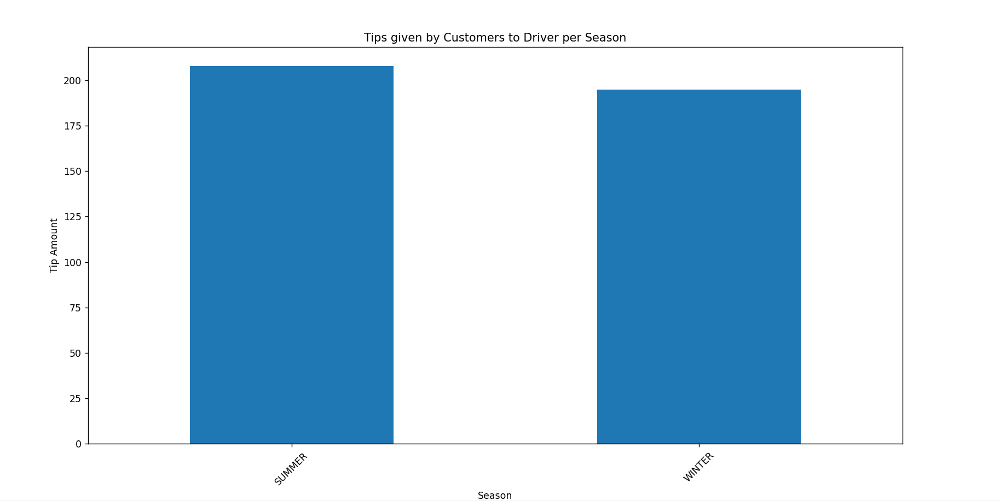

# Assessing a Dataset

A client has approached your team for help in investigating a taxi customer's seasonal spending habits in New York City. 

They want to know: **Do yellow taxi passengers in New York City tip drivers more in the winter or summer?**

Your team is in the [Capturing](Readme.md#Capturing) stage of the Data Science Lifecycle and you are in charge of handling the dataset. You have been provided a [data](../data/taxi.csv) to explore.

## Instructions

- Assess whether or not the data in this dataset can help answer the question.
- Explore the [NYC Open Data catalog](https://data.cityofnewyork.us/browse?sortBy=most_accessed&utf8=%E2%9C%93). Identify an additional dataset that could potentially be helpful in answering the client's question.
- Write 3 questions that you would ask the client for more clarification and better understanding of the problem. 

Refer to the [dataset's dictionary](https://www1.nyc.gov/assets/tlc/downloads/pdf/data_dictionary_trip_records_yellow.pdf) and [user guide](https://www1.nyc.gov/assets/tlc/downloads/pdf/trip_record_user_guide.pdf) for more information about the data.

# Assignment Solution
Click [here](data-capturing.py) for this assignment solution. Output is demonstrated in below screenshot.  
  