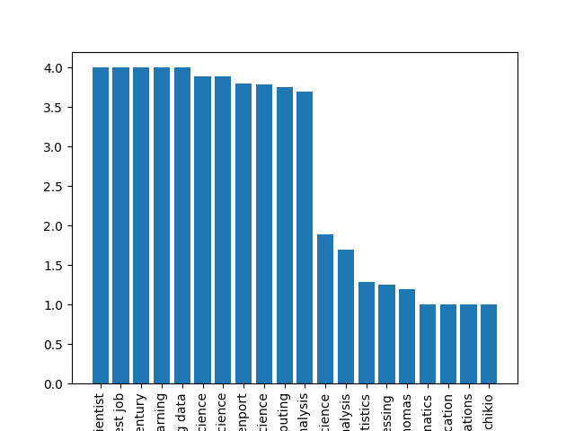
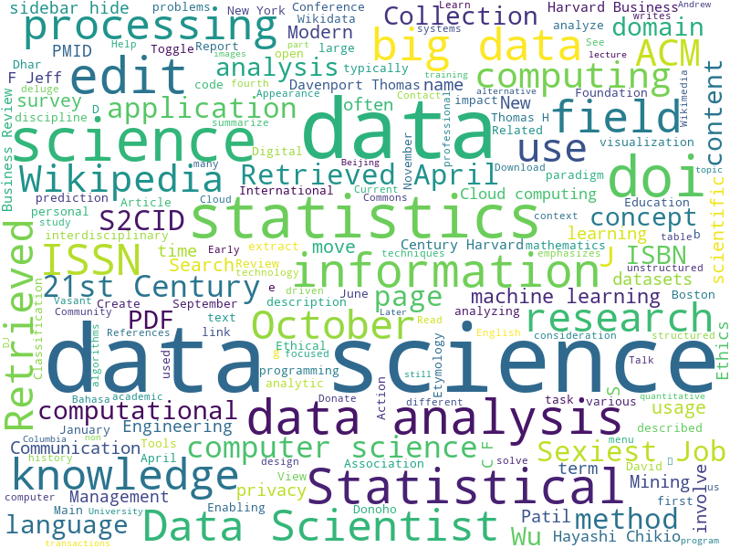

# Description
Couple of programs related to Data Science.

# Dependencies on modules (pip install ***)
1. requests - to make HTTP calls
2. nlp_rake - for keyword extraction
3. matplotlib - for plotting simple distribution of keywords based on their relevance  
4. wordcloud - another way to visualize word frequencies

# List of Programs
1. Text Mining program  
The program to read a wikipedia text about [Data Science](https://en.wikipedia.org/wiki/Data_science), extract related keywords out of it and try to visualize the results. This program illustrates the importance of data pre-processing and cleaning, because clear picture at the end will allow us to make better decisions.  
  Output:  
    
  
  