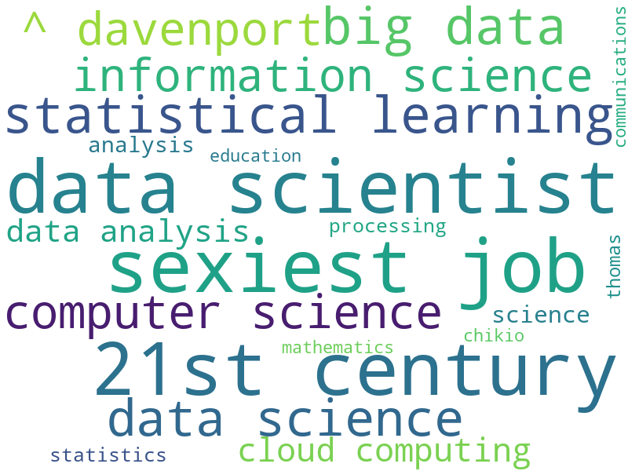

## Description
Couple of programs related to Data Science Introduction topic.
  
    
      
## Dependencies on modules 
### Internal Dependencies
1. requests - to make HTTP calls
2. html.parser
3. os - for dealing with file handling

### External Dependencies (pip install ***)
1. nlp_rake - for keyword extraction
2. matplotlib - for plotting simple distribution of keywords based on their relevance  
3. wordcloud - another better way to visualize word frequencies
4. numpy - for probability and statistics calculations
5. pandas - for data analysis (probability and statistics calculations )

## List of Programs
### Text Mining program   
[This program](./data-science-scenarios-assignment.md) is a good example to learn the steps of the data journey in Data Science i.e.
- **Data Acquisition**  
The program to read a wikipedia text about [Data Science](https://en.wikipedia.org/wiki/Data_science)
- **Data Processing**  
extract related keywords out of it
- **Visualization / Human Insights**  
visualize the results  
This program illustrates the importance of data pre-processing and cleaning, because clear picture at the end will allow us to make better decisions.  
  **Output:**   
  ![]
  ![]
  ![]
  ![]  

### Probability And Statistical Function Computation
Learn to calculate mean, standard deviation, variance, median, plot histograms.  
[Python Program](./probability-statistics.py)

## Assignment and Solution
1. Assignment 1: [Data Science Scenarios](./data-science-scenarios-assignment.md)  
2. Assignment 2: [Ethics](./ethics-assignment.md)
3. Assignment 3: [Defining Data](./defining-data-assignment.md)

## 🌟 Developer
Name: Rohit Shamrao Muneshwar  
Email: rohit.muneshwar1406@gmail.com  
LinkedIn Profile: [Click Here](https://www.linkedin.com/in/rohit-muneshwar-a9079258/)  
Other Github repositories: [Click Here](https://github.com/rohit1406?tab=repositories)  

---