## Description
Couple of programs related to Data Science & **Data Visualization** topic. A visualization can help you identify all kinds of interesting parts of your data such as spikes, outliers, groupings, tendencies, and more, that can help you understand the story your data is trying to tell. In this part we will learn how to create interesting visualizations all around the concept of quantity using **line charts, scatterplots, bar plots**, data distribution.

## List of Programs
### 1. Visualizing Quantity: Observe Wingspan of birds   
[This program](./vis_quantity.py) demonstrates the usage Matplotlib library to **observe** the data of the birds from birds.csv file. It plots basic line plots, line plots with labelling on x, y coordinates, scatter chart to find outliners and to filter those outlines from the observation.  
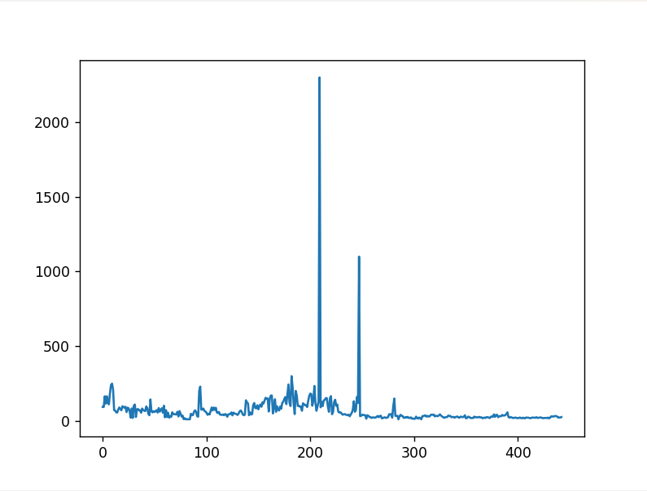
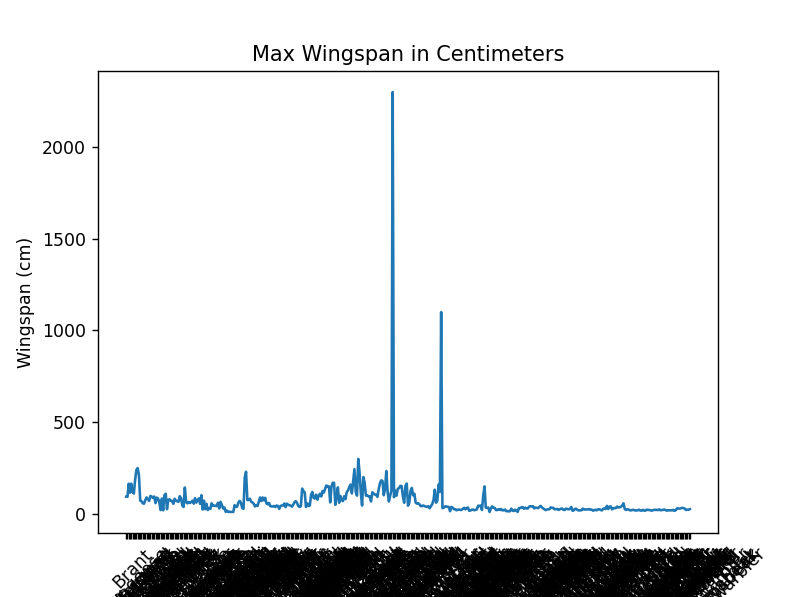
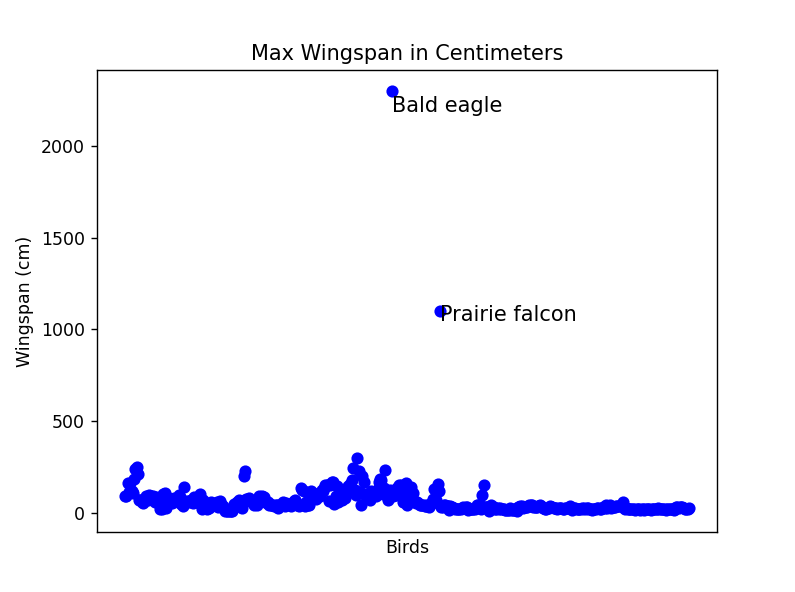
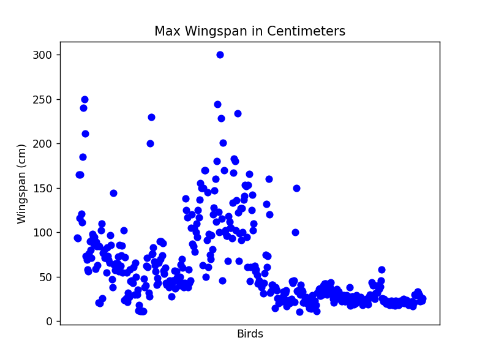  

**Exploring the bar chart (showing grouping of data)**:  
It plots the bar chart based on the number of birds based on category.  
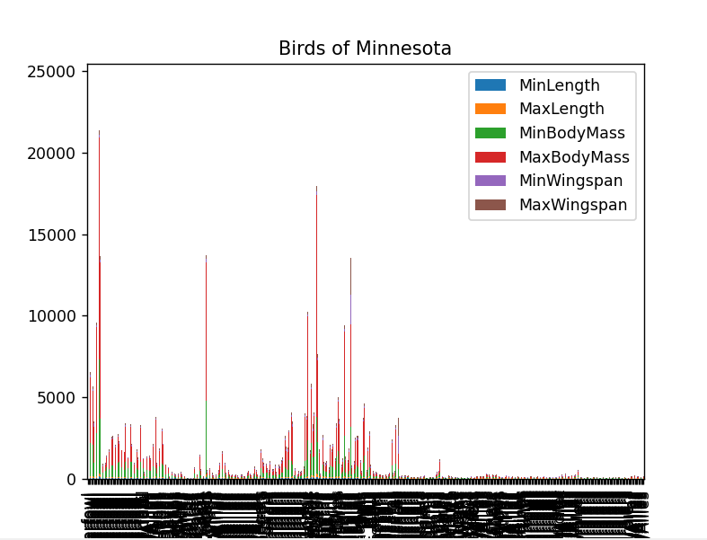
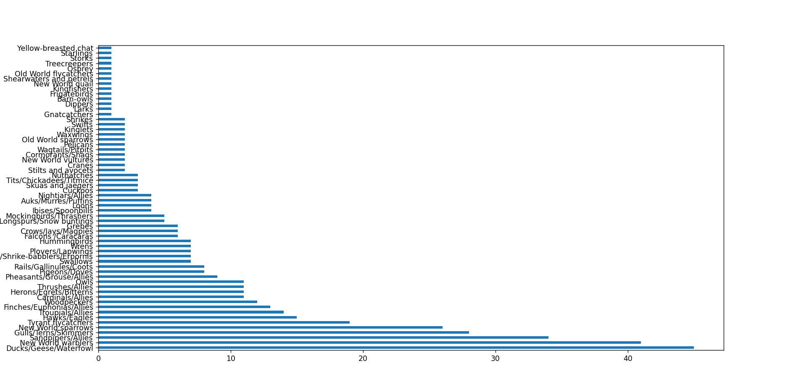  

**Comparing Data**:  
Compare Max Length of a bird in each category and superimpose min, max length data per category.  
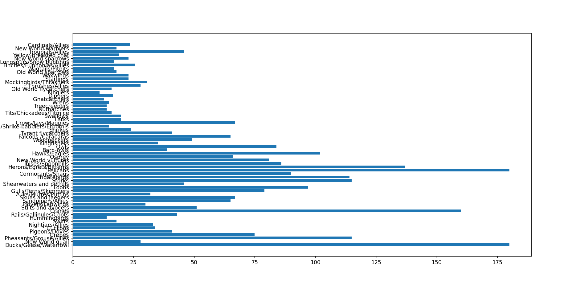
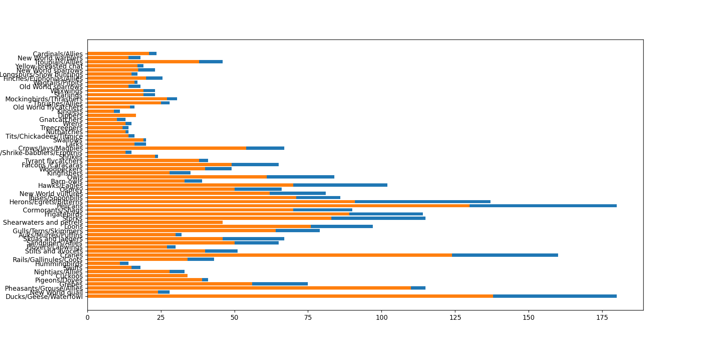  

### 2. Visualizing Distribution: Exploring the birds dataset
[This program](./vis_distribution.py) demonstrates the another way to dig into data by it's distribution i.e. how the data is organized along an axis.  
General Distribution of **max length per bird order** is demonstrated in below **scatter plot**.  
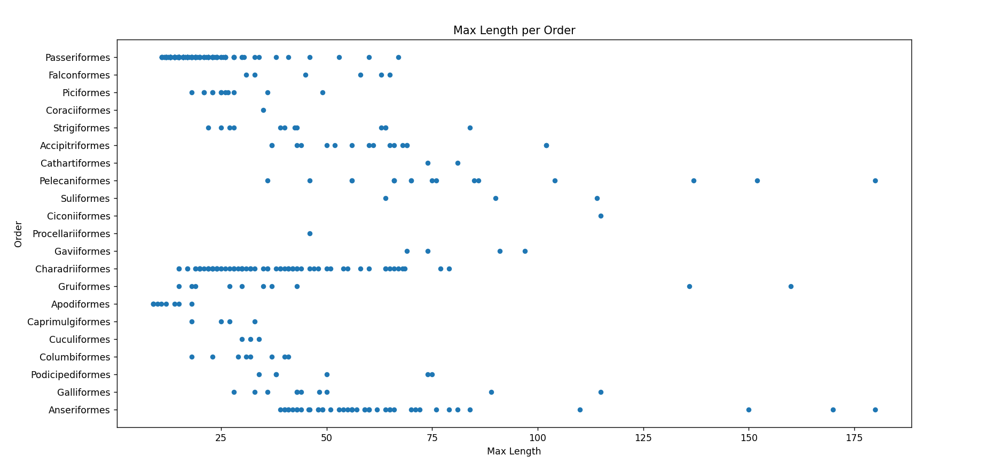  
Following **Histogram** shows the distribution of max body mass.  
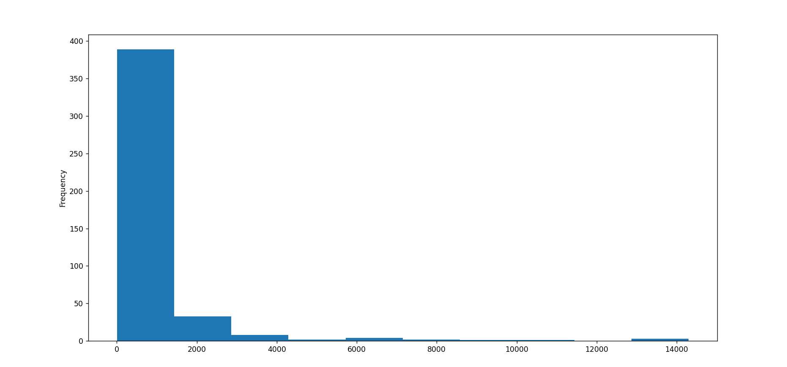   
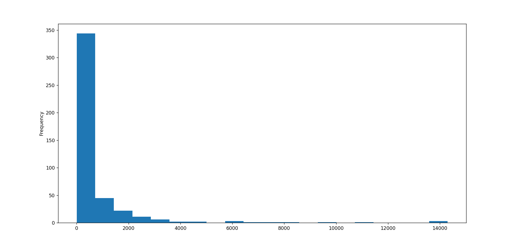   
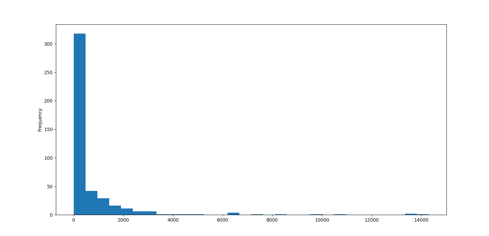   
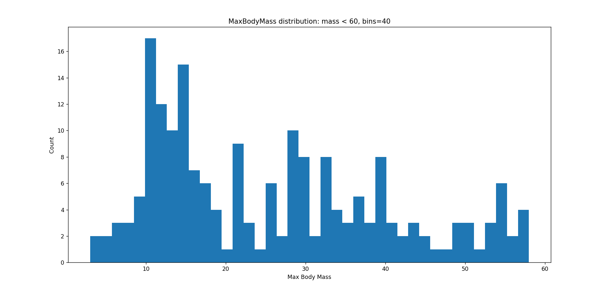  
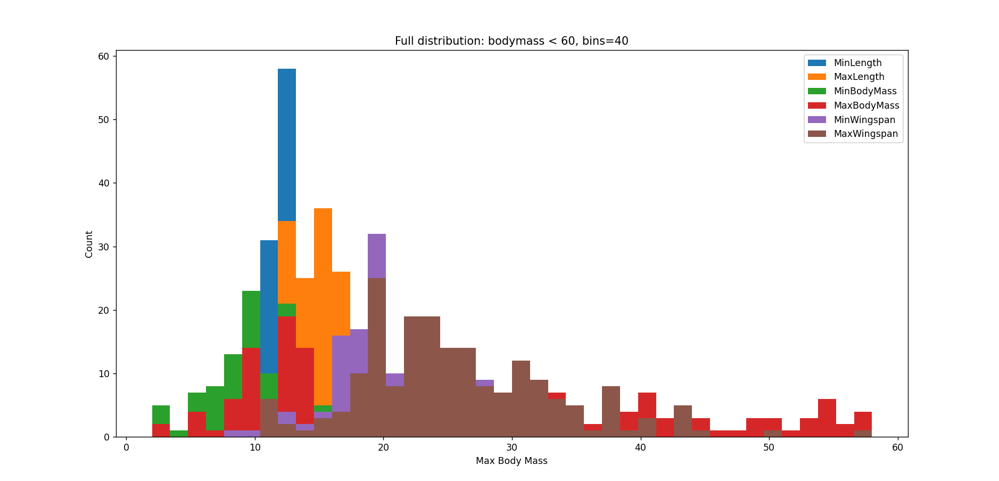  

Comparison: **MaxBodyMass vs MaxLength**  
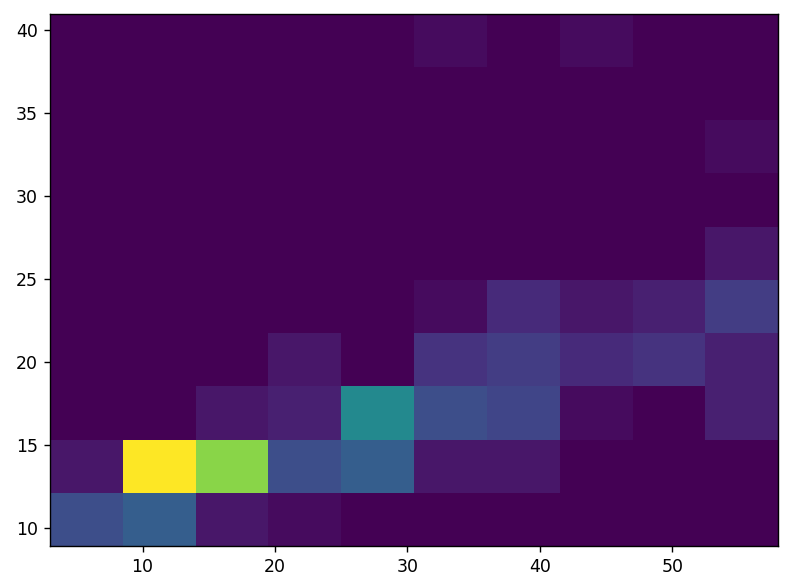  

**Distribution according to textual data**:  
Digging into conservation information such as genus, species, family as well as conservation status.  
**Conservation Status vs MinWingspan**:  
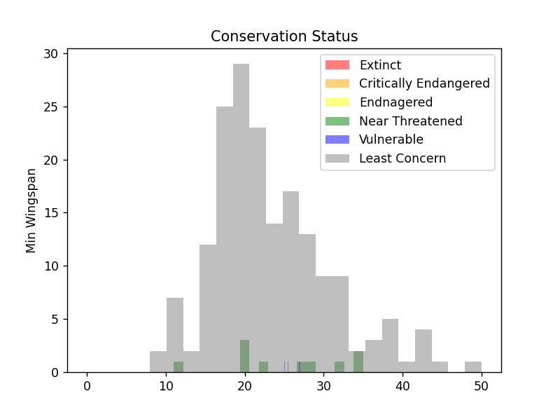  

### 3. Density plot
To show smoother density chart, use density plot. [This Program](./vis_distribution_density.py) show how to draw density plots. 
Density plot of **MinWingspan and MaxBodyMass** is as below.  
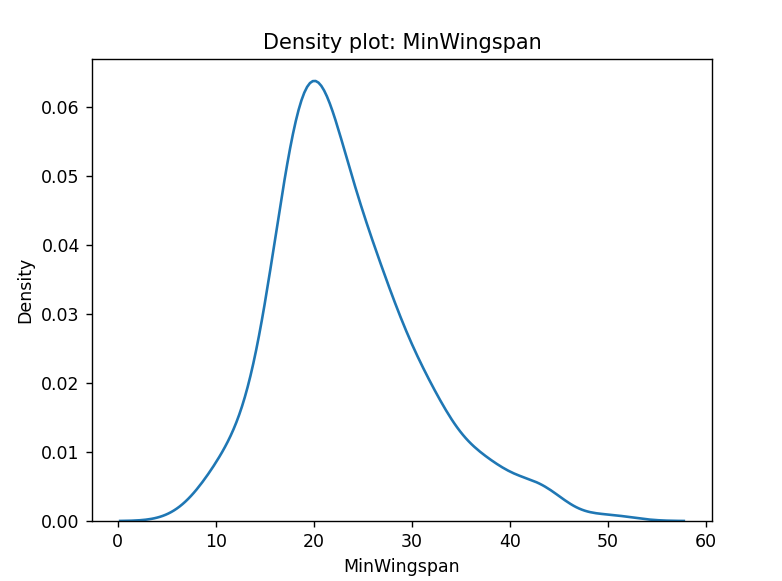   
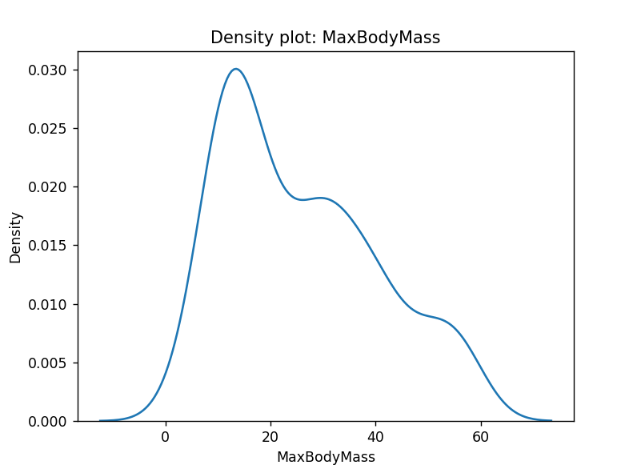  

## Assignment and Solution
1. Assignment 1:   

## Related Knowledge
Use the best chart to suit your data's structure and the story you want to tell.  

1. To analyze trends over time: line  
2. To compare values: bar, column, pie, scatterplot  
3. To show how parts relate to a whole: pie  
4. To show distribution of data: scatterplot, bar  
5. To show trends: line, column  
6. To show relationships between values: line, scatterplot, bubble  

[Matplotlib Cheatsheets](https://matplotlib.org/cheatsheets/cheatsheets.pdf)  

## 🌟 Developer
Name: Rohit Shamrao Muneshwar  
Email: rohit.muneshwar1406@gmail.com  
LinkedIn Profile: [Click Here](https://www.linkedin.com/in/rohit-muneshwar-a9079258/)  
Other Github repositories: [Click Here](https://github.com/rohit1406?tab=repositories)  

---