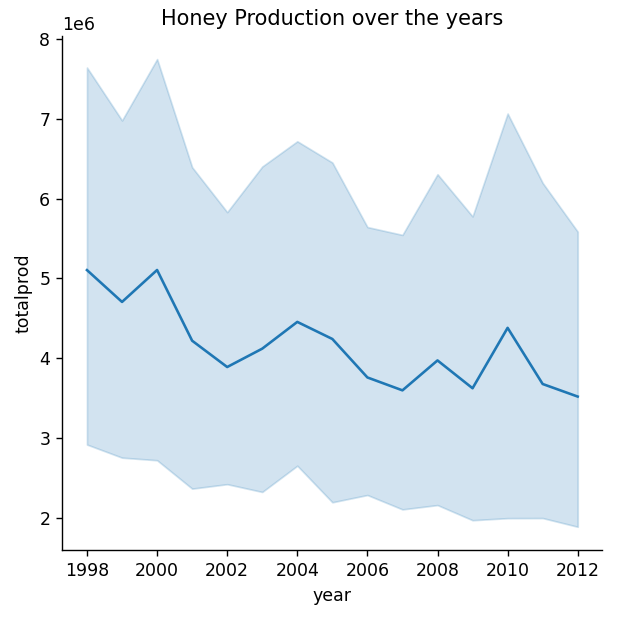

## Description
Couple of programs related to Data Science & **Data Visualization** topic. A visualization can help you identify all kinds of interesting parts of your data such as spikes, outliers, groupings, tendencies, and more, that can help you understand the story your data is trying to tell. Prior to visualizing your data, you need to ensure that it has been cleaned and prepared. After that, you can start deciding how best to present the data. In this part we will learn how to create interesting visualizations all around the concept of quantity using **line charts, scatterplots, bar plots**, data distribution using **Histograms and Density plots**, proportions using **pie charts, donut charts and waffle charts, Scatter plots, line charts, Facet grids, Dual-line plots**.

## List of Programs
### 1. Visualizing Quantity: with Birds dataset   
[This program](./vis_quantity.py) demonstrates the usage Matplotlib library to **observe** the data of the birds from [birds.csv](../data/birds.csv) file. It plots basic line plots, line plots with labelling on x, y coordinates, scatter chart to find outliners and to filter those outlines from the observation.  

  

#### **Exploring the bar chart (showing grouping of data)**:  
It plots the bar chart based on the number of birds based on category.  

  

#### **Comparing Data**:  
Compare Max Length of a bird in each category and superimpose min, max length data per category.  

  

### 2. Visualizing Distribution: Exploring the birds dataset
[This program](./vis_distribution.py) demonstrates the another way to dig into data by it's distribution i.e. how the data is organized along an axis.  

#### General Distribution of **max length per bird order** is demonstrated in below **scatter plot**.  
  

#### Following **Histogram** shows the distribution of max body mass.  
Below are the comparison images:  

#### Comparison: **MaxBodyMass vs MaxLength**  

#### **Distribution according to textual data**:  
Digging into conservation information such as genus, species, family as well as conservation status.  
**Conservation Status vs MinWingspan**:  
  

### 3. Density plot: with birds dataset
To show smoother density chart, use density plot. [This Program](./vis_distribution_density.py) show how to draw density plots.   

#### Density plot of **MinWingspan and MaxBodyMass** is as below.  
Below are the comparison images:  

#### Density plot of **MaxBodyMass per bird Order**:  

#### **Map several fields** (MaxLength, MinLength of a bird) in a single chart:  

### 4. Visualize Proportions: with Mushrooms dataset
[This program](./vis_proportion.py) demonstrates the analysis and visualization of [mushrooms data](../data/mushrooms.csv). First, you need to group your data into categories and then decide which is the best way to display the data - pie, donut, or waffle.    
#### **Mushrooms population** is shown with below **pie chart**. 
   

#### **Mushrooms Habitat** is shown with below **donut chart**.  
  

#### **Mushrooms cap colors** is displayed with below **Waffle chart**
  

### 5. Visualizing Relationships: All About Honey
[This program](./vis_relationships.py) shows the relationship between various factors of [data of honey production in US](../data/honey.csv).

#### Relationship between the Price per pound and it's US state of origin
Below are the comparison images:  

#### Relationship between Price per pount and totalProduction over the years
Below are the comparison images:  

#### Yield Per Colonies and Number of Colonies over the years

#### Dual-line plot
    

### 6. Dangerous Liaisons data visualization project
[Project Link](./sample-network-app/README.md)  

## 🌟 Developer
Name: Rohit Shamrao Muneshwar  
Email: rohit.muneshwar1406@gmail.com  
LinkedIn Profile: [Click Here](https://www.linkedin.com/in/rohit-muneshwar-a9079258/)  
Other Github repositories: [Click Here](https://github.com/rohit1406?tab=repositories)  

---